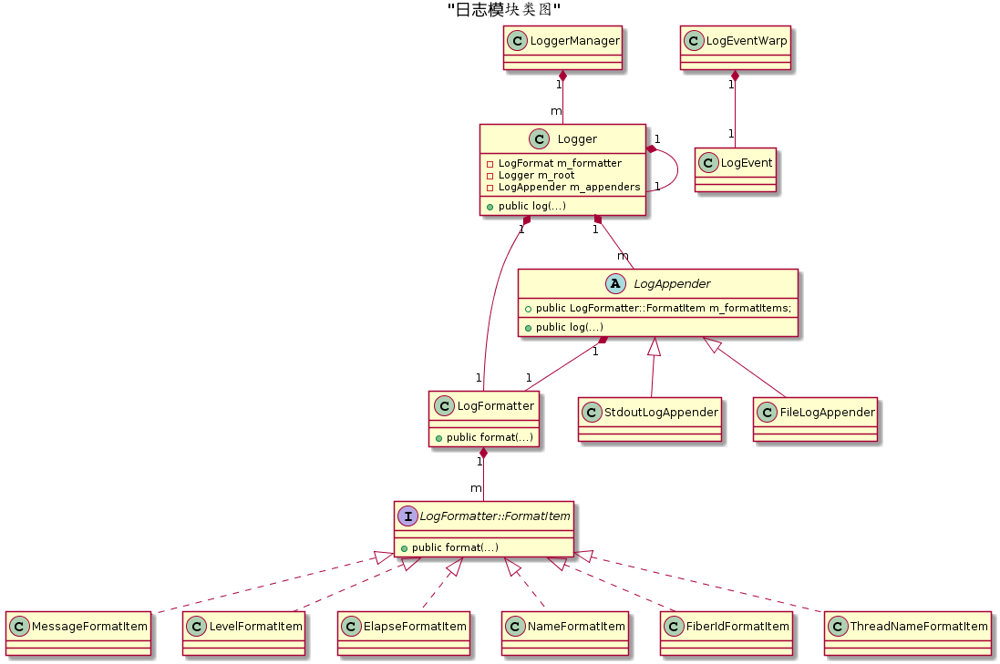

# sylar-wxb
- 高性能服务器框架
- 感谢来源：https://github.com/sylar-yin/sylar

# 日志模块

## Logger 日志器
- 提供日志写入方法

## LogAppender 日志输出器
- 日志的输出方式

## LogFormat 日志格式器
- 日志的输出格式，参考log4j

## LogManager 日志管理器
- 管理所有日志器，通过YAML配置

## LogEvent 日志事件
- 将要写的日志

# 协程调度模块
- 线程池去运行调度器的run函数（执行调度器的逻辑）

## API
- swapcontex(&ctx1, &ctx2)：切换上下文，执行ctx2空间的逻辑